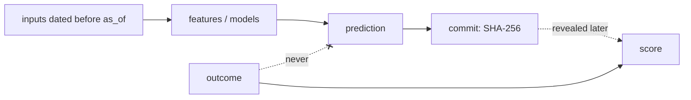

# ouroboros-guard

**Leakage and circularity guardrails for agentic science, mathematics and engineering.**

> The outcome must never be an ancestor of the prediction, and every check you report must have been able to fail.

An AI agent that predicts experimental results, evaluates a theory or proves a theorem can score
brilliantly by accident: a search tool returns the paper that reports the answer, a feature only exists
because of the outcome, the test set leaks through repeated looks, a proof quietly assumes its own
conclusion. Nothing malicious happens. The loop just closes. A check that could not have failed carries
zero bits of evidence, however impressive the number.

ouroboros-guard makes those loops hard to create and easy to see. It works with any agent (Claude Code,
Codex, Cursor, your own harness), any language (CLI + JSON-lines), and plain Python pipelines.

Background essay: [The Ouroboros Problem](https://www.christopheryamba.com/posts/the-ouroboros-problem/).



## What it does

| Problem | Tool |
|---------|------|
| The agent reads outcomes, holdout labels or answer keys | `sealed_paths` + a Claude Code hook that blocks reads, greps, shell access and fetches |
| Search or RAG returns documents written after the prediction time | `TimeFirewall` (dates are treated as intervals; undated is suspect) |
| Nobody can tell what influenced a prediction | a hash-chained provenance **ledger** and an **information graph** with checks G0–G10 |
| "We predicted it" with no proof of timing | **commit-reveal**: publish a SHA-256 commitment before the outcome exists |
| Preprocessing or selection on all data, double dipping | **negative controls**: rerun the whole pipeline on scrambled labels; it must fall to chance |
| Test items that are near-copies of training items | **split audit** (n-gram Jaccard, cosine, Tanimoto) and group/time splits |
| Hill-climbing on the test set | **HoldoutGuard** (strict budget or Thresholdout) |
| Scores too good to be true | **replicate ceiling**: the best any honest model can do given measurement noise |
| "Validated" by a check that would pass anyway | **evidence weight** in bits (Bayes factor) |
| The model memorised the answers | **temporal gap** (before vs after training cut-off), **memorisation probe**, entity masking |
| Circular proofs, smuggled equivalents, backward reasoning | **proof dependency graphs** (P0–P6) and a **Lean 4** `#print axioms` audit |
| "Is this result trustworthy?" | the **ten-question audit**, answered from evidence on disk |

## Quick start

```bash
pip install git+https://github.com/cyamba/ouroboros-guard   # or, in a clone: pip install -e ".[dev]"
oguard init                            # writes oguard.yaml and .oguard/
```

Record what the prediction used, commit it, then check:

```bash
oguard log input --id input:assays --available-at 2026-01-15 --file data/inputs/assays.csv
oguard log prediction --id prediction:E-12 --target E-12 --parent input:assays --meta model=my-model
oguard commit predictions.jsonl --prediction prediction:E-12      # publish predictions.jsonl.commit.json
oguard check                                                     # exit 1 on critical findings
oguard audit --format md --out AUDIT.md
```

Prove a pipeline cannot score on noise:

```bash
oguard control --cmd "python train_eval.py --labels {labels}" --labels data/labels.csv --runs 100
```

Check a proof for circularity:

```bash
oguard proof examples/proofs/sinx_lhopital.yaml
# [critical] P1-cycle: circular dependency: limit <- lhopital <- derivative_of_sine <- difference_quotient <- limit
# [critical] P2-goal-smuggled: the proof of 'limit' depends on the goal itself.
```

Is a reported score plausible?

```bash
oguard ceiling --agreement 0.82 --claimed 0.97
# claimed 0.970 is above the ceiling 0.900 -> investigate for leakage
oguard evidence --p-pass-h 1 --p-pass-not-h 1 --prior 0.2
# K = 1, 0.00 bits, posterior 20.0% -> circular
```

## Try the examples

```bash
python examples/feature_selection_leak/run.py   # 96% "accuracy" on pure noise, caught by the negative control
python examples/agent_session/demo.py           # an honest and a leaky agent session, side by side
for f in examples/proofs/*.yaml; do oguard proof "$f"; done
oguard lean-axioms examples/lean/print_axioms_output.txt
```

## For agents

| File | Purpose |
|------|---------|
| [`AGENTS.md`](AGENTS.md) | the operating contract: invariants, workflows, reporting rules |
| [`CLAUDE.md`](CLAUDE.md) | Claude Code specifics (imports AGENTS.md) |
| [`.claude/skills/`](.claude/skills) | playbooks: prediction protocol, leakage audit, time firewall, negative controls, split audit, proof validity, theory review |
| [`.claude/settings.json`](.claude/settings.json), [`hooks/claude/guard.py`](hooks/claude/guard.py) | hooks that block sealed reads, log retrievals and refuse to stop on critical findings |
| [`.cursor/rules/`](.cursor/rules) | Cursor rule pointing at AGENTS.md |
| [`hooks/git/pre-commit`](hooks/git/pre-commit) | refuses salts, broken graphs and edited committed predictions |
| [`rules/`](rules) | the rule catalogue and policy packs (prospective experiments, LLM benchmarks, ML models, formal math) |
| [`context/`](context) | principles, glossary and audit questions to load into an agent's context |

## Documentation

- [Implementation plan](docs/IMPLEMENTATION_PLAN.md): layers, phases, release gates and limitations
- [Architecture](docs/ARCHITECTURE.md): components, trust boundaries, ledger schema, configuration
- [Math](docs/MATH.md): the results every check rests on
- [Threat model](docs/THREAT_MODEL.md): leak channels L1–L7, statistical and proof channels
- [Proof graph format](docs/PROOFS.md)
- [Integrations](docs/INTEGRATIONS.md): Claude Code, Cursor, git, CI, Python, Lean

## What it cannot do

It cannot prove that a language model never saw an answer; it measures memorisation instead. It trusts the
dates it is given. Hooks are seatbelts, not vaults: keep outcomes out of the agent's reach for real
guarantees. A structurally valid proof is not thereby a correct one. See the
[limitations](docs/IMPLEMENTATION_PLAN.md#7-limitations).

## Status

v0.1: the core library, CLI, hooks, skills and docs are usable and tested (`python -m pytest`).
Planned: an MCP server with firewalled retrieval, a sealed evaluator service, automatic Lean dependency
extraction, and a "leak zoo" regression suite. Contributions welcome: see [CONTRIBUTING.md](CONTRIBUTING.md).

## License

MIT. Created by Christopher Yamba, in collaboration with AI.
