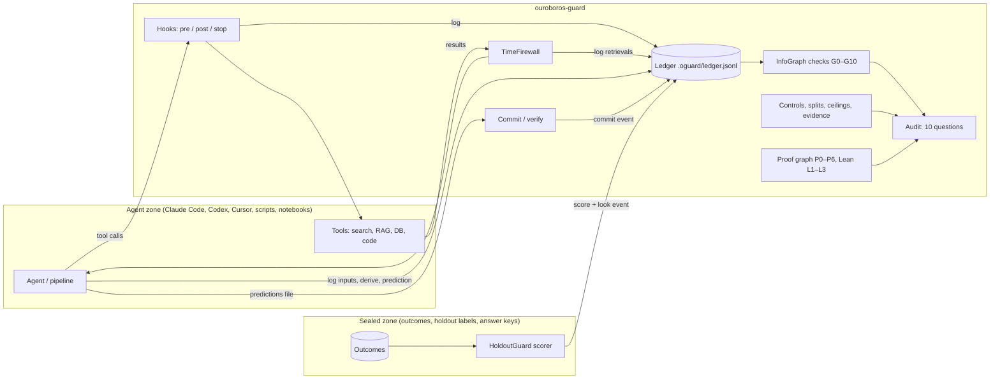

# Architecture

## Components



Information may flow from the agent zone into the sealed zone (committed predictions), and a **score** may
flow back. Outcomes never flow into the agent zone before predictions are committed.

## Trust boundaries

| Boundary | Protects | Mechanism | Strength |
|----------|----------|-----------|----------|
| Separate machine or storage for outcomes | outcomes | access control outside the agent's reach | strong |
| Sealed paths in the workspace | outcomes kept locally | PreToolUse hook (stdlib-only, fail-closed) | medium: a shell can bypass it |
| Time firewall on tools | the as-of date | wrapping retrieval; `blocked_sources` | medium: depends on metadata |
| Ledger + graph checks | detection | hash chain, ancestry and timing rules | detects what was logged |
| Commit-reveal | timing claims | SHA-256 with a 256-bit salt | strong |

## The ledger

One JSON object per line, appended only. Fields:

| Field | Meaning |
|-------|---------|
| `id` | unique id, conventionally `<type>:<name>` |
| `type` | `input`, `retrieval`, `tool_call`, `derive`, `label`, `prediction`, `commit`, `outcome`, `look`, `judge`, `control`, `note` |
| `t` | when the event was recorded (UTC) |
| `available_at` | when the information existed or was first public (partial dates allowed) |
| `parents` | ids of events this one was derived from (information-flow edges) |
| `target` | what a prediction or outcome is about |
| `source` | file, URL, DOI, tool name |
| `content_sha256` | hash of the content, when a file or text is attached |
| `meta` | free-form: `as_of`, `model`, `origin`, `session`, `context`, `set`, ... |
| `prev`, `hash` | hash chain: `hash = sha256(canonical(event without hash))`, `prev` = previous line's hash |

`verify_chain()` reports edited, removed, reordered or duplicated lines.

## The information graph

Edges run parent → child. Extra implicit edges, when `context_is_ancestor` is on: every `retrieval` and
`tool_call` recorded before a prediction becomes its parent, unless the prediction has
`meta.context = "isolated"`.

Checks per prediction `Ŷ` with prediction time `τ(Ŷ)` = `meta.as_of`, else the config `as_of`, else the
first commit time, else the event time:

- **G1** an `outcome` with the same target in `Anc(Ŷ)`;
- **G2 / G3 / G4** every ancestor's `available_at` is present, before `τ(Ŷ)`, and not ambiguous;
- **G5 / G6** a commit exists and precedes the outcome's recording.

Global checks: **G7** cycles (Tarjan's algorithm), **G8** looks per evaluation set against the budget,
**G9** judge and generator share a model, **G10** several ancestors share an `origin`.

## Configuration (`oguard.yaml`)

| Key | Default | Meaning |
|-----|---------|---------|
| `as_of` | null | prediction time for the whole project |
| `model_training_cutoff` | null | the language model's training cut-off, for audit question 2 |
| `ledger` | `.oguard/ledger.jsonl` | ledger path |
| `evidence_dir` | `.oguard` | where controls, split reports and metrics are written |
| `sealed_paths` | `data/holdout/**`, `data/outcomes/**`, `**/*.answers.*` | globs agents may not touch |
| `blocked_sources` | `[]` | regular expressions for outcome-publishing sources |
| `missing_date_policy` | `warn` | `reject`, `warn` or `allow` for undated and ambiguous information |
| `budget.test_looks` | 1 | looks allowed per evaluation set |
| `controls.permutations`, `.tolerance`, `.chance` | 200, 0.05, null | negative-control settings |
| `splits.similarity_threshold`, `.max_fraction_above` | 0.9, 0.0 | near-duplicate definition |
| `ceiling.replicate_agreement`, `.test_retest_r` | null | measurement reproducibility |
| `judge.require_different_model` | true | enable G9 |
| `context_is_ancestor` | true | implicit context edges for LLM agents |

## Evidence directory

```
.oguard/
  ledger.jsonl            provenance
  controls/<name>.json    negative-control results
  split_report.json       split audit
  metrics.json            {"value": <reported score>} for the ceiling check
```

## Module map

| Module | Responsibility |
|--------|----------------|
| `timeutil` | dates as intervals, `is_before` with an explicit "ambiguous" answer |
| `config` | defaults, discovery, template |
| `ledger` | append-only hash-chained events |
| `graph` | information graph and checks G0–G10 |
| `firewall` | as-of and source filtering for retrieval |
| `commit` | commit-reveal |
| `controls` | permutation and command controls, entity masking, temporal gap |
| `splits` | nearest-neighbour similarity, split audit, group and time splits |
| `budget` | `HoldoutGuard` (strict, Thresholdout) |
| `ceiling` | replicate ceilings |
| `evidence` | Bayes factor and weight of evidence |
| `proofs` | proof dependency graphs P0–P6 |
| `lean` | Lean 4 `#print axioms` audit |
| `contamination` | memorisation probe |
| `audit` | the ten questions |
| `cli` | `oguard` |
